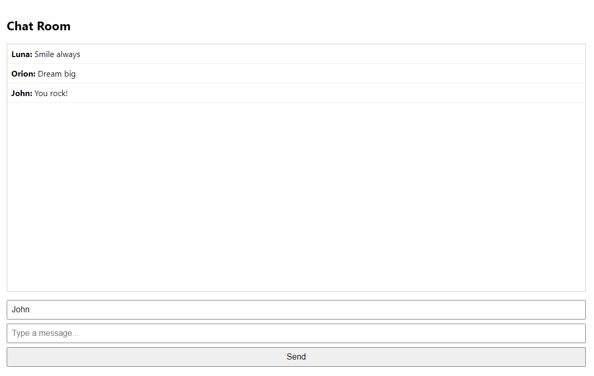

# Chat Room
General Chat. Made with Next.JS, Socket.IO, MongoDB and other new technologies. There is shitcode available in the backend, I didn't try to make a complex and smart system.

<details>
<summary>Installing the client part</summary>

```bash
npm i -g yarn # if yarn is not installed
cd Client
cp .env.example .env
nano .env # configure the .env using nano or another editor you are comfortable with
yarn
yarn run build
yarn run start
```

</details>

<details>
<summary>Installing the server part</summary>

```bash
npm i -g yarn # if yarn is not installed
cd Server
cp .env.example .env
nano .env # configure the .env using nano or another editor you are comfortable with
yarn
yarn run build
yarn run start
```

</details>
<br>


